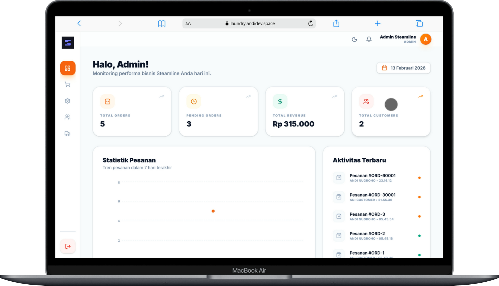

# 🧺 Steamline — Laundry Management System

A comprehensive web-based management system for laundry businesses, featuring specialized portals for **Admin**, **Cashier**, **Driver**, and **Customer**.

> 🌐 **Live Demo:** [laundry.andidev.space](https://laundry.andidev.space)

## 📸 Preview



---

## 🚀 Tech Stack

| Layer      | Technology                                              |
| :--------- | :------------------------------------------------------ |
| **Backend**  | Python Flask, MySQL, JWT (Flask-JWT-Extended), Bcrypt  |
| **Frontend** | React (Vite), Tailwind CSS, Framer Motion, Radix UI   |
| **State**    | Zustand                                                |
| **HTTP**     | Axios                                                  |
| **Deploy**   | Vercel (Frontend), Gunicorn (Backend)                  |

---

## 🛠️ Prerequisites

- [Python 3.10+](https://www.python.org/downloads/)
- [Node.js 18+](https://nodejs.org/)
- [XAMPP](https://www.apachefriends.org/index.html) or MySQL Server
- [Git](https://git-scm.com/)

---

## 📦 Installation & Setup

### 1. Clone the Repository

```bash
git clone https://github.com/andifrfrfr/service-laundry.git
cd service-laundry
```

### 2. Database Setup

1. Open **phpMyAdmin** or your preferred MySQL client.
2. Create a new database named `laundry_db`.
3. Import the `schema.sql` file located in the root directory.
   - This will create all necessary tables and seed an initial Admin account.

### 3. Backend Setup

```bash
cd backend
python -m venv venv
```

Activate the virtual environment:

- **Windows:** `venv\Scripts\activate`
- **Mac/Linux:** `source venv/bin/activate`

Install dependencies & configure environment:

```bash
pip install -r requirements.txt
cp .env.example .env
```

Edit `.env` to match your MySQL configuration:

```env
DB_HOST=localhost
DB_USER=root
DB_PASSWORD=
DB_NAME=laundry_db
JWT_SECRET_KEY=your-secret-key-here
FLASK_APP=run.py
FLASK_ENV=development
```

Run the backend server:

```bash
python run.py
```

> API will be available at `http://127.0.0.1:5000`

### 4. Frontend Setup

```bash
cd frontend
npm install
npm run dev
```

> Application will be accessible at `http://localhost:5173`

---

## 🔐 Default Login Credentials

After importing the database, you can log in with any of the following accounts:

| Role       | Username    | Password     | Full Name        |
| :--------- | :---------- | :----------- | :--------------- |
| Admin      | `admin`     | `admin123`   | Admin Steamline  |
| Cashier    | `kasir1`    | `admin123`   | Siti Kasir       |
| Driver     | `driver1`   | `admin123`   | Budi Driver      |
| Driver     | `alex`      | `driver123`  | Alex             |
| Customer   | `customer1` | `admin123`   | Ani Customer     |
| Customer   | `andi`      | `user123`   | Andi Nugroho     |

> **Note:** Accounts with password `admin123` share the same bcrypt hash from the initial seed. The `andi` and `alex` accounts were registered manually with different passwords.

---

## 📝 Features

### 👑 Admin Dashboard
- Manage laundry services (CRUD)
- Manage all users & roles
- Monitor overall business performance (revenue, orders, customers)
- Order statistics chart (7-day trend)
- Recent activity log

### 💰 Cashier Portal
- Create new laundry orders
- Manage payments and update order statuses
- Assign drivers for delivery

### 🚗 Driver App
- View assigned delivery schedules
- Update delivery progress in real-time

### 👤 Customer Portal
- Place new laundry orders
- Track laundry status in real-time
- View order history & notifications
- Self-registration

### 🔔 Notifications
- Real-time notifications for order status updates

### 📊 Real-time Tracking
- Log-based tracking for every stage: *Pending → Washing → Drying → Ironing → Ready for Delivery → Delivery → Completed*

---

## 📁 Project Structure

```text
service-laundry/
├── backend/                # Flask REST API
│   ├── app/
│   │   ├── __init__.py     # App factory & config
│   │   ├── models.py       # Database models
│   │   └── routes.py       # API endpoints
│   ├── .env.example        # Environment template
│   ├── requirements.txt    # Python dependencies
│   └── run.py              # Entry point
├── frontend/               # React + Vite Application
│   ├── src/
│   │   ├── api/            # Axios configuration
│   │   ├── components/     # Reusable UI components
│   │   ├── context/        # Auth context provider
│   │   ├── hooks/          # Custom React hooks
│   │   ├── pages/
│   │   │   ├── admin/      # Admin dashboard & management
│   │   │   ├── auth/       # Login & Register pages
│   │   │   ├── cashier/    # Cashier portal
│   │   │   ├── customer/   # Customer portal
│   │   │   ├── driver/     # Driver delivery management
│   │   │   └── public/     # Landing & public pages
│   │   └── App.jsx         # Root component & routing
│   ├── package.json
│   └── vite.config.js
├── schema.sql              # Database structure & seed data
└── README.md
```

---

## 👤 Author

**Andi Nugroho**

- GitHub: [@andi-nugroho](https://github.com/andi-nugroho)
- Email: [andidelouise@gmail.com](mailto:andidelouise@gmail.com)

---

## 📄 License

This project is licensed under the [MIT License](LICENSE).
